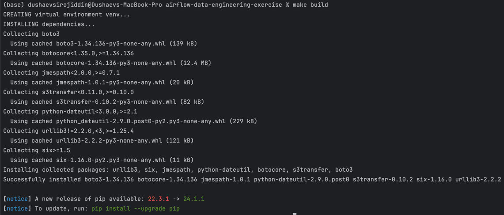
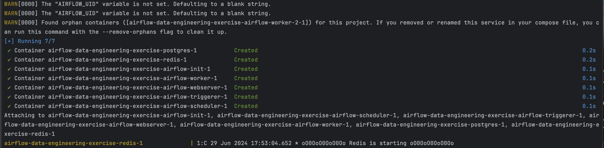
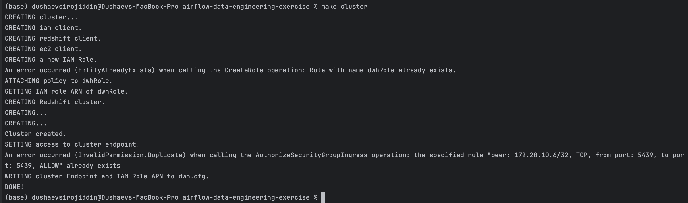
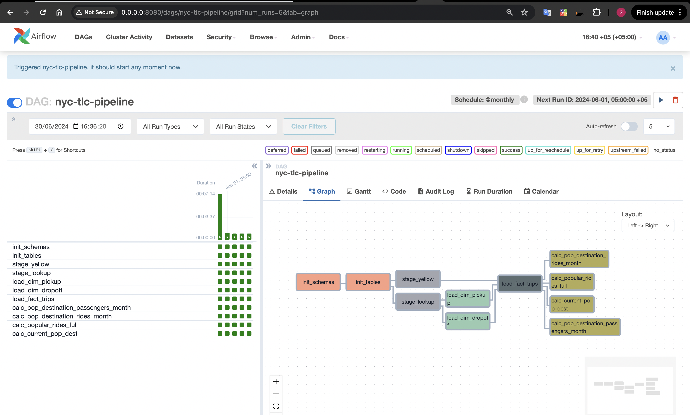
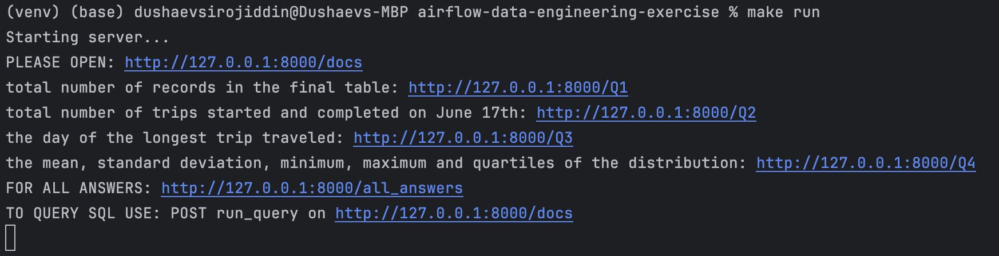
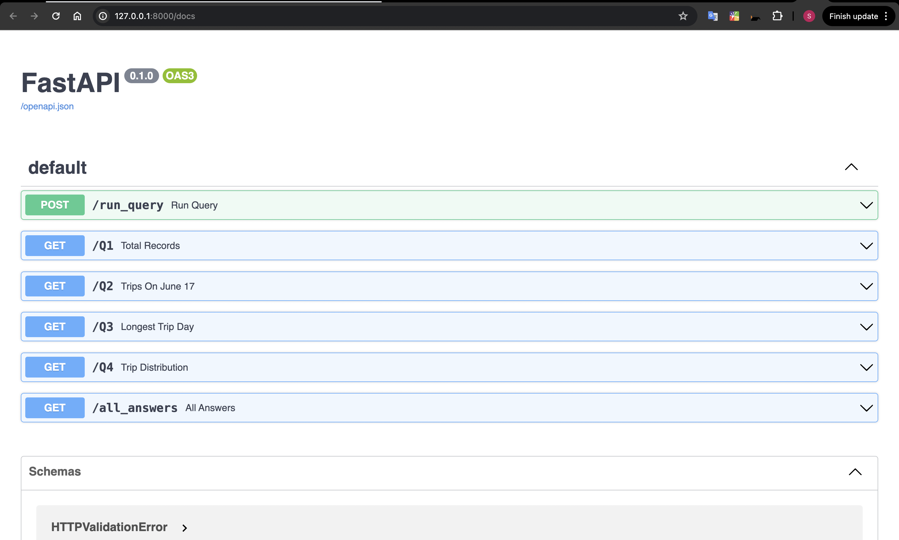
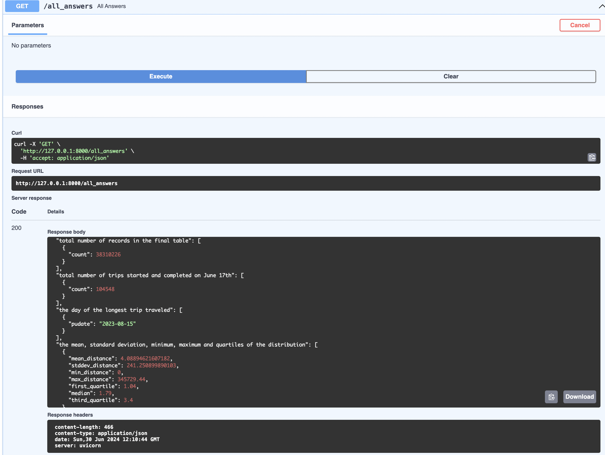
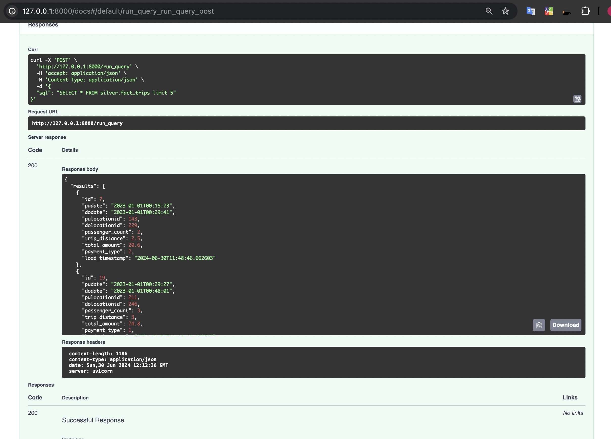
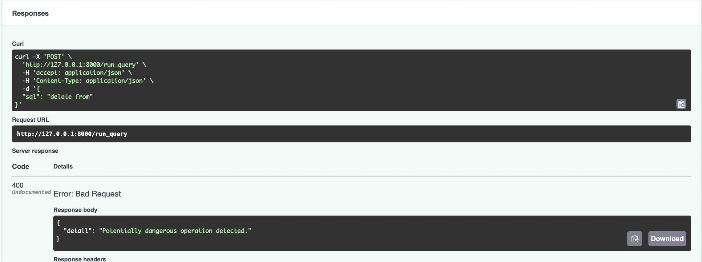

# New York Taxi Rides Data Pipeline

## Overview
This project develops an ETL pipeline for New York taxi ride data, using AWS Redshift, S3, and parquet files. The data is processed through multiple layers (raw, trusted, refined) and made accessible via a FastAPI backend. This solution is designed to answer specific analytical questions about taxi rides.

## Technologies Used
- **Python**: For writing the ETL scripts and API server.
- **AWS S3**: Used for storing raw data in Parquet format.
- **AWS Redshift**: Data warehouse for storing and querying processed data.
- **Apache Airflow**: Managed with Docker to orchestrate the ETL pipeline.
- **FastAPI**: To create a RESTful API for data querying.
- **Docker & Docker Compose**: For containerization of the Airflow scheduler and workers.

## Project Structure
- `dags/`: Contains Airflow DAG definitions for the ETL process.
- `plugins/`: Custom Airflow plugins or helpers used in the ETL process.
- `app/`: FastAPI application for the API endpoint.
- `Makefile`: Defines commands to manage the project's lifecycle.

## Setup Instructions
1. **Clone the Repository**
   ```bash
   git clone <repository-url>
   cd path-to-repository
   ```

2. **Build the Project**
Use the Makefile command to build necessary Docker images and prepare your environment. This step ensures that all dependencies and required structures are correctly configured before running the project:
   ```bash
   make build
   ```
   
   

3. **Start the Data Cluster**
Initialize your AWS Redshift cluster and other necessary services. This command typically involves starting up the cloud services and ensuring that they are ready to receive data:
   ```bash
   make cluster
   ```
   
   
   After that run the DAG
   

4. **Run the FastAPI Server**
Start the FastAPI server to handle API requests. This will activate the server on the specified port and make it ready to respond to API calls:
   ```bash
   make run
   ``` 
    
5. **Access the API**
Once the server is running, you can interact with the API:

   Open your web browser and navigate to the following URL to access the FastAPI Swagger UI. This interface allows you to directly interact with all available API endpoints, providing a user-friendly way to send requests and receive responses:
   ```bash
   http://127.0.0.1:8000/docs
   ```  
   

   This URL opens the Swagger documentation for your API, where you can test the endpoints, see expected responses, and view the schema of your data.

   For all answers use all_answers endpoint
   

   TO QUERY SQL USE: POST run_query on http://127.0.0.1:8000/docs
   

   NOTE: you can not drop or delete using this endpoint due to security constraints
   


6. **Clean Up Resources**
When you are finished with testing or running the project, use the following command to clean up resources. This is especially important in a cloud environment like AWS to prevent unnecessary charges for services that are no longer in use:
   ```bash
   make clean
   ```  
   This command typically shuts down all services started by the project, deletes temporary files, and ensures that there are no residual costs associated with the cloud resources.


7. **SMILE)**

Author: Dushaev Sirojiddin 